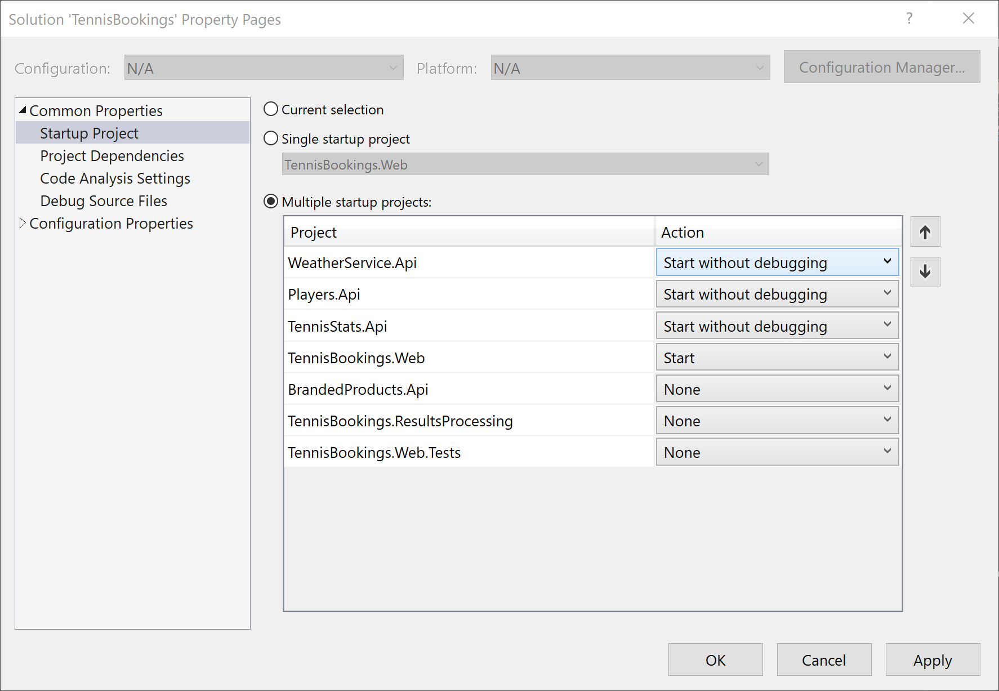

# Getting Started

This download contains a Visual Studio solution and the project files from Module 3.

To run the solution in Visual Studio... 

- Load the "before" solution from the "0 - Before" directory.
- The Tennis Bookings web application depends on the WeatherApi service to load its weather forecasts. Both projects need to be started in order for this application to function. Other APIs will also be required later in the course. Right-click on the solution and choose "Set StartUp Projects..."
  - Ensure that the WeatherService.API is set to "Start without Debugging".
  - Ensure that the Players.API is set to "Start without Debugging".
  - Ensure that the TennisStats.API is set to "Start without Debugging".
  - Ensure that TennisBookings.Web is set to "Start" and is below all API projects in the startup order.

- Ensure that the TennisBookings.Web solution is configured with the correct local port used by the Weather Service API. This is defined in the appsettings.json file under ExternalServices > WeatherApi > Url.
- Ensure that the TennisBookings.Web solution is configured with the correct local port used by the Player API. This is defined in the appsettings.json file under ExternalServices > TennisPlayersApi > Url.
- Ensure that the TennisBookings.Web solution is configured with the correct local port used by the Statistics API. This is defined in the appsettings.json file under ExternalServices > StatisticsApi > Url.
- Press F5 or click the Start button to begin debugging.

Alternatively, you can right click on each project to start debugging.

Alternatively you can run the projects individually from the .NET Command Line using "dotnet run".

## Credentials

To login to the Tennis Booking web application as an administrator, use the following credentials.

- Username = admin@example.com
- Password = Password1!